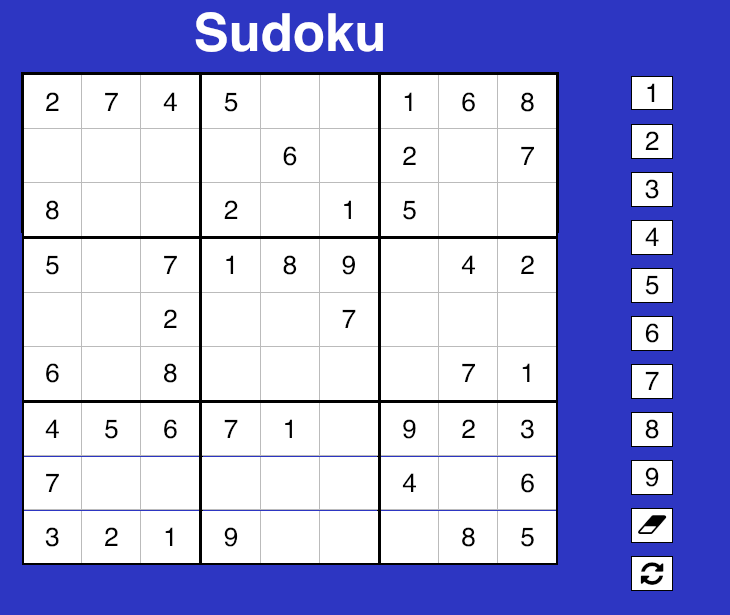

### Sudoku App Built from scratch with React

[Live Link](https://react-sudoku-24b70.web.app//)



### Local Installation
 1. Enter 'NPM install' in the root directory
 2. Enter 'NPM run dev' to run start and sass in one terminal OR complete steps 3 and 4 below
 3. Enter 'NPM run start' in the current terminal
 4. Enter 'NPM run sass' in a new second terminal
 5. After step 2 or steps 3 and 4 above, Open 'index.html' in the dist folder or from the root enter 'open dist/index.html'
 
### Technologies and Libraries:
 1. HTML
 2. SCSS/CSS
 3. JavaScript
 4. React

This project has a simple and intuitive interface with minimal styling.

This Sudoku implementation uses a functional style within the boardBuilder.js file to create an accurate board. All relevant data is passed into each function call, as below. This logic was worked out from scratch with little to no reference as an added challenge.

``` javsacript
  function sampleNext(arr, numbers, nRow, nextCols, row, nTried, numbsUsed){
    const valid = nextCols.filter(el=> numbers.includes(el) && !row.includes(el));
    if (nRow.length || valid.length) {
      let el, idx;
      if (nRow.length) {
          idx = randIdx(nRow);
          el = nRow.splice(idx,1)[0];
      } else {
        el = valid[randIdx(valid)];
      }
      return getNumber(numbers, el, nTried);
    } else {
      return sample(arr, numbers, nTried, row, numbsUsed);
    }
  }
```

### Site Features:

* Responsive buttons and react lifecycle methods
* Creates a unique board each time the website is refreshed.
